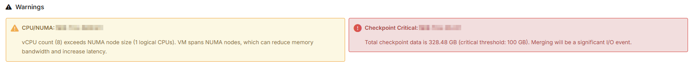
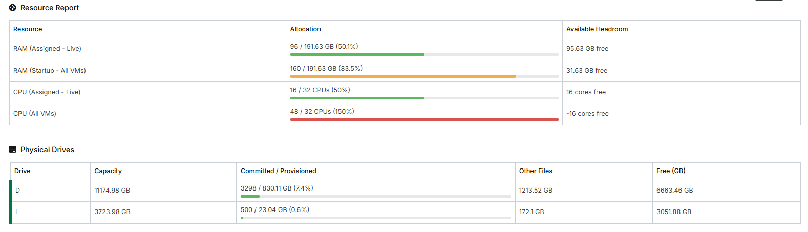
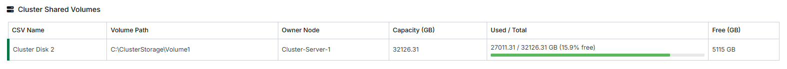
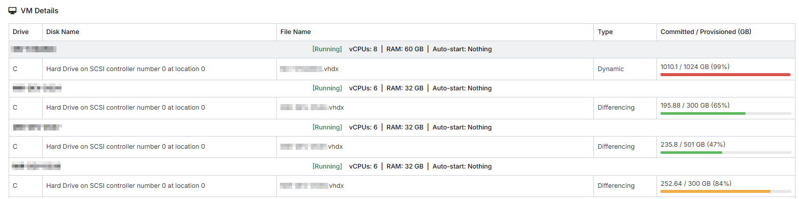
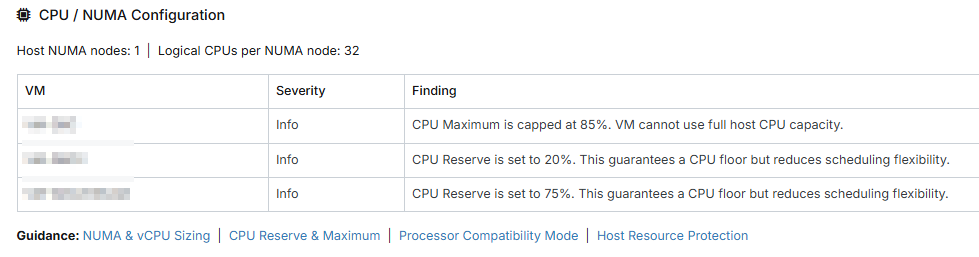
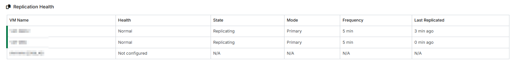
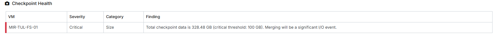

# Hyper-V Health Report for NinjaOne

A mostly comprehensive health monitoring solution for Hyper-V hosts that generates an HTML report in NinjaOne.

## Overview

This script collects capacity and health data from Hyper-V hosts and displays it as a beautiful, color-coded HTML card in NinjaOne. It can be used either as a **Condition** to trigger alerts and update the custom field report, or as a **Scheduled Automation** for just the custom field report.

## Prerequisites

- Hyper-V host with PowerShell module installed
- Script must run as **SYSTEM** (default for NinjaOne automations)
- One WYSIWYG Field

---

### Custom Field Requirements

1. Navigate to **Administration** → **Devices** → **Device custom fields**
2. Click **Add custom Field**
3. Configure:
   - **Field Type**: **WYSIWYG**
   - **Name**: `hypervHealth`
   - **Label**: `Hyper-V Health`
   - **Inheritance**: Device
   - **Permissions**: Automations:Write, Technician access: Read, API: None (reduce pulling WYSIWYG fields via API, they can be huge)
   - **Advanced Settings**: Recommend expanding large values on render, and adding this field to it's own Custom Field Tab.
4. Click **Save**

---

## Configuration

### Script Variables (Optional)

All settings have sensible defaults. I suggest overriding them per-device or per-policy to customize behavior.

#### Disk Thresholds

| Variable              | Type    | Default | Description                                                                 |
|-----------------------|---------|---------|-----------------------------------------------------------------------------|
| `diskWarnThresholdGb` | Integer | `100`   | GB of free headroom (capacity - provisioned) below which a drive is flagged |

#### Checkpoint Thresholds

| Variable | Type | Default | Description |
| ---------- | ------ | --------- | ------------- |
| `checkpointWarnAgeDays` | Integer | `7` | Days before a checkpoint triggers a warning |
| `checkpointCritAgeDays` | Integer | `14` | Days before a checkpoint triggers a critical alert |
| `checkpointWarnSizeGB` | Decimal | `50` | Total AVHDX footprint (GB) per VM - warning level |
| `checkpointCritSizeGB` | Decimal | `100` | Total AVHDX footprint (GB) per VM - critical level |
| `checkpointWarnChainDepth` | Integer | `2` | Checkpoint chain depth - warning level |
| `checkpointCritChainDepth` | Integer | `5` | Checkpoint chain depth - critical level |

#### Alert Flags (Control What Affects Exit Code)

These flags let you control which categories contribute to the exit code. Set to `false` to suppress noisy categories while still displaying them in the HTML report.

| Variable | Type | Default | Description |
| ---------- | ------ | --------- | ------------- |
| `alertOnDiskOverprovisioning` | Boolean | `true` | Include disk overprovisioning in alerts |
| `alertOnRAMOverprovisioning` | Boolean | `true` | Include RAM overprovisioning in alerts |
| `alertOnCPUOverprovisioning` | Boolean | `false` | Include CPU overprovisioning in alerts |
| `alertOnReplicationWarning` | Boolean | `false` | Include replication warnings in alerts |
| `alertOnReplicationCritical` | Boolean | `true` | Include replication critical status in alerts |
| `alertOnCheckpointWarning` | Boolean | `false` | Include checkpoint warnings in alerts |
| `alertOnCheckpointCritical` | Boolean | `true` | Include checkpoint critical findings in alerts |
| `alertOnCSVWarning` | Boolean | `false` | Include CSV warnings in alerts |
| `alertOnCSVCritical` | Boolean | `true` | Include CSV critical status in alerts |

#### CSV (Cluster Shared Volume) Thresholds

| Variable              | Type    | Default | Description                                                    |
|-----------------------|---------|---------|----------------------------------------------------------------|
| `csvWarnThresholdPct` | Integer | `15`    | CSV % free below which a volume is flagged as warning          |
| `csvCritThresholdPct` | Integer | `5`     | CSV % free below which a volume is flagged as critical         |

---

## Exit Codes

The script uses exit codes to indicate overall health status:

| Code | Status | Description |
| ------ | -------- | ------------- |
| `0` | ✅ Healthy | No enabled alert categories are breached |
| `1` | ⚠️ Warning | At least one enabled category is in a warning state |
| `2` | 🔴 Critical | At least one enabled category is in a critical state |

**Severity Rationale**:

- **Critical (Exit 2)**: Disk/RAM overprovisioning, replication failures, severe checkpoint issues - conditions that prevent normal operation or indicate imminent risk
- **Warning (Exit 1)**: CPU oversubscription, moderate checkpoint concerns - performance impacts but VMs continue running

---

## Report Sections

### 1. Warnings (Top Section)

Highlights all critical and warning conditions in expandable cards including:

- **Disk Overprovisioning**: Warns when provisioned virtual disk space exceeds physical capacity
- **RAM Overprovisioning**: Alerts when startup RAM exceeds host memory (cannot cold-boot all VMs)
- **CPU Oversubscription**: Tracks vCPU:pCore ratios and NUMA spanning issues
- **Replication Health**: Monitors Hyper-V Replica status and last replication times
- **Checkpoint Management**: Flags old, oversized, or deep checkpoint chains
- **CSV Storage**: Monitors cluster shared volume capacity on clustered hosts

This section is hidden if everything is healthy.

*Warning cards showing detected issues with severity levels*

### 2. Resource Report

High-level overview of RAM, CPU, and disk allocation across all VMs with progress bars showing utilization:

- **RAM Tracking**: Both live-assigned and startup configuration (cold-boot capacity)
- **CPU Allocation**: Live and total vCPU assignments with oversubscription detection
- **Disk Capacity**: Physical drive provisioning vs. committed space with headroom calculations

*Resource allocation progress bars showing RAM, CPU, and disk usage*

### 3. Physical Drives

Detailed capacity view of local drives showing provisioned vs. committed space and headroom.

**Note**: This section is automatically hidden if all VMs are on Cluster Shared Volumes.

### 4. Cluster Shared Volumes

CSV capacity and owner node information with free space monitoring (clustered hosts only).

**Note**: This section is automatically hidden on standalone hosts.

*Cluster Storage allocation and free space*

### 5. VM Details

Comprehensive per-VM breakdown including:

- Current state (Running, Off, Paused, Saved)
- vCPU count with NUMA span warnings
- RAM allocation (assigned or startup)
- Auto-start configuration
- Virtual disk details with type (Fixed/Dynamic/Differencing) and committed/provisioned space
- Color-coded state indicators

*Detailed per-VM information including disks and configuration*

### 6. CPU / NUMA Configuration

Advanced processor configuration findings including:

- Per-VM processor settings and NUMA topology analysis
- NUMA span warnings
- vCPU:pCore ratio analysis
- Compatibility mode flags
- CPU caps, reserves, and resource protection settings
- Links to guidance because this is under-understood

*CPU and NUMA configuration findings*

### 7. Replication Health

Hyper-V Replica status with complete replication health monitoring:

- Health state (Normal, Warning, Critical)
- Replication mode and frequency
- Last replication time and sync status
- Lists unreplicated VMs for visibility

**Note**: This section is automatically hidden if no VMs are configured for replication.

*VM Replication Health Status*

### 8. Checkpoint Health

Checkpoint analysis showing:

- Age violations (checkpoints older than thresholds)
- Size violations (total AVHDX footprint per VM)
- Chain depth violations (number of checkpoints per VM)

*VM Checkpoint Health Status*

---

## Troubleshooting

### Script Doesn't Run

**Symptoms**: No data appears in the `hypervHealth` field.

**Solutions**:

1. Verify the custom field `hypervHealth` exists and is type **WYSIWYG**
2. Verify the custom field permissions allows Automations to WRITE.
3. Check that the script is running as **SYSTEM**
4. Check NinjaOne activity log for script execution errors

### Exit Code Always 0 (No Alerts)

**Symptoms**: Issues are visible in HTML but no alerts trigger.

**Solution**:

- Check alert flags - the relevant category may have its alert flag set to `false`. For example, if CPU overprovisioning shows in the report but doesn't trigger alerts, verify `alertOnCPUOverprovisioning` is set to `true`.
- Make sure you're running the script as a Condition, and are looking for Result Code not equal to 0 (or equal to 2 if limiting to critical issues.)

---

## Performance Considerations

- **Execution Time**: Typically 5-30 seconds depending on number of VMs and disk count
- **Resource Impact**: Minimal - read-only operations with local caching
- **Recommended Schedule**: Daily

---

See the TODO section in the script for planned enhancements.
